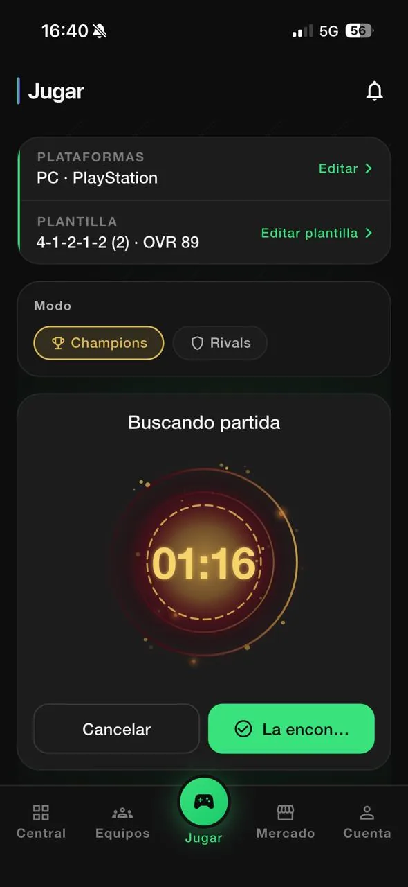
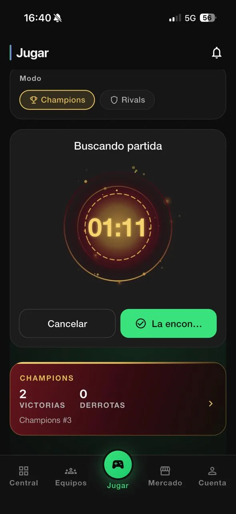
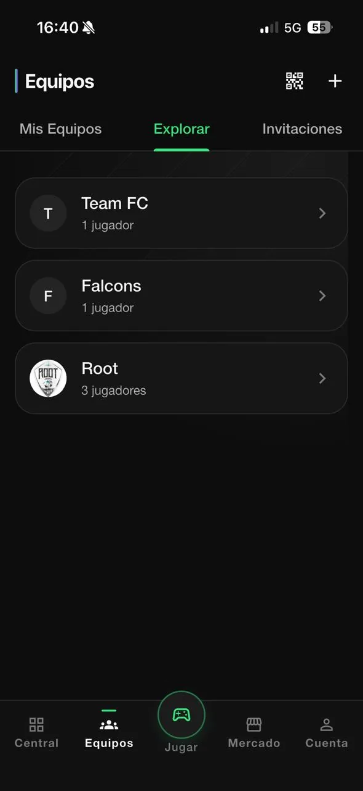
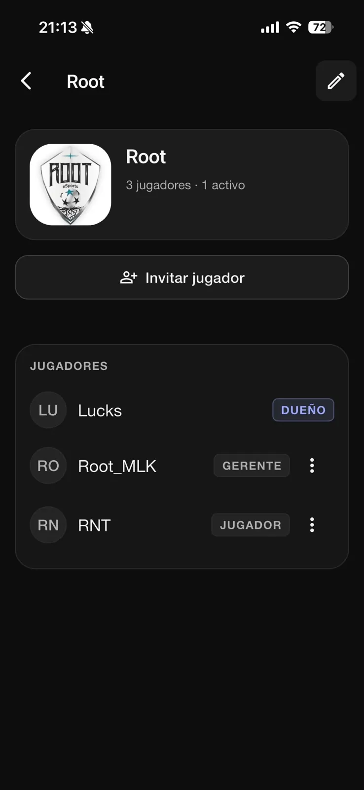
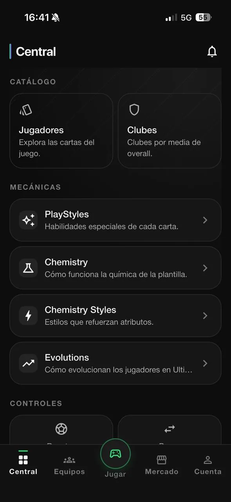
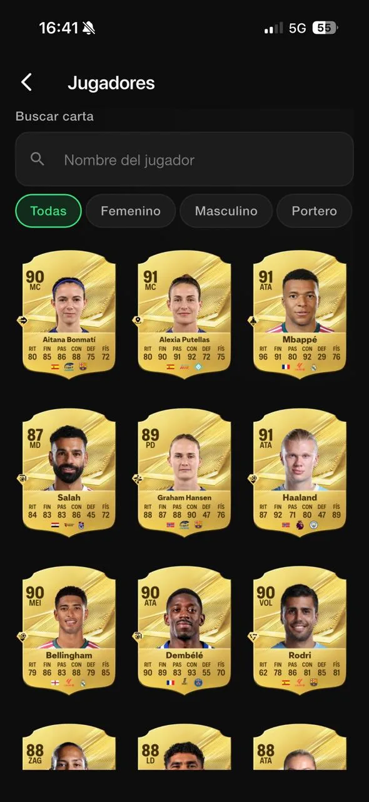
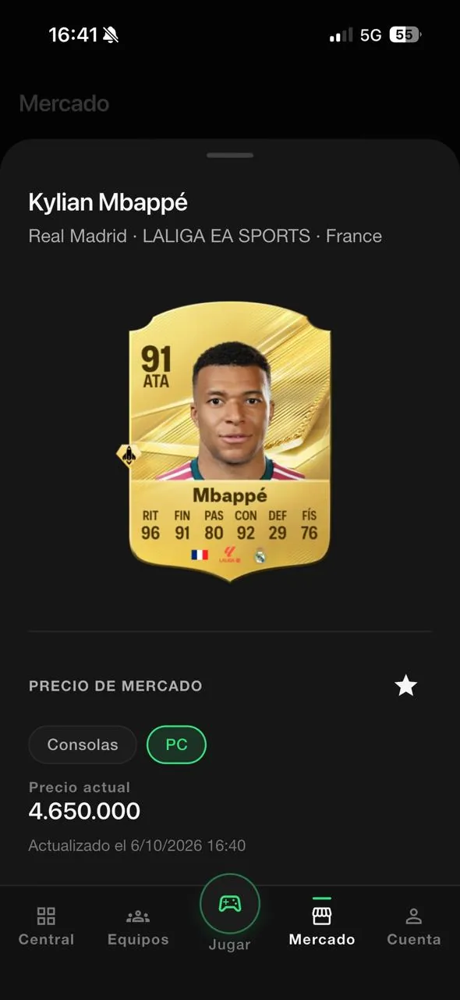
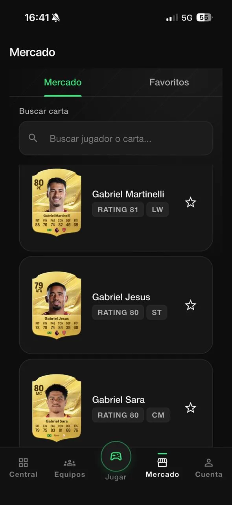
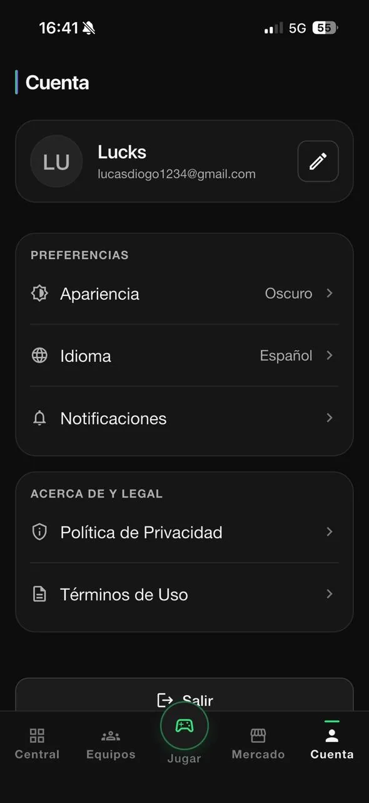

<p align="center">
  
</p>

<h1 align="center">Match Queue</h1>

<p align="center">
  Cola de matchmaking en tiempo real y herramientas de equipo para jugadores competitivos de EA SPORTS FC.
</p>

<p align="center">
  
  
  
  
  
</p>

<p align="center">
  <a href="README.md">English</a> · <a href="README.pt-BR.md">Português</a> · <b>Español</b>
</p>

---

Match Queue ayuda a un equipo de jugadores que comparten el mismo modo de juego (Champions o Rivals) a no buscar partido al mismo tiempo y terminar enfrentándose entre sí. Solo un miembro del equipo busca a la vez; los demás esperan en una cola ordenada y toman la búsqueda automáticamente cuando les toca. Alrededor de esa cola, la app suma gestión de equipos, catálogo de cartas, constructor de plantilla, guías del juego y precios de mercado.

## Disponibilidad

<a href="https://apps.apple.com/br/app/match-queue/id6810790338"></a>

- **iOS**: publicada en la App Store.
- **Android** y **Web (PWA)**: generadas a partir del mismo código.
- **Idiomas**: inglés, portugués (Brasil) y español.

## Pantallas

### De la cola al partido

<table>
<tr><td align="center" valign="top"><br><sub><b>Jugar</b></sub></td><td align="center" valign="top"><br><sub><b>Buscando partida</b></sub></td><td align="center" valign="top"><br><sub><b>Equipos</b></sub></td></tr>
<tr><td align="center" valign="top"><br><sub><b>Equipo</b></sub></td></tr>
</table>

### Central y Mercado

<table>
<tr><td align="center" valign="top"><br><sub><b>Central</b></sub></td><td align="center" valign="top"><br><sub><b>Jugadores</b></sub></td><td align="center" valign="top"><br><sub><b>Detalle de la carta</b></sub></td></tr>
<tr><td align="center" valign="top"><br><sub><b>Mercado</b></sub></td><td align="center" valign="top"><br><sub><b>Cuenta</b></sub></td></tr>
</table>

## Funcionalidades

**Matchmaking**
- Cola de búsqueda en tiempo real por equipo y modo de juego (Champions o Rivals), con plataforma y plantilla elegidas antes de buscar.
- Una búsqueda activa a la vez: mientras un miembro está en `SEARCHING`, los demás quedan en `QUEUED`, en orden.
- Promoción automática: cuando quien busca encuentra partido, cancela o se le agota el tiempo, el siguiente de la cola empieza a buscar.
- Temporizador en el servidor, con expiración automática de búsquedas vencidas y un tiempo de espera tras cada búsqueda.
- Flujo de "partido encontrado", que lleva al equipo al partido y registra el resultado.
- Historial de búsquedas y partidos por equipo y por cuenta.

**Equipos**
- Crear, explorar y unirse a equipos; página pública del equipo.
- Roles de los miembros (dueño, gestor y jugador), con transferencia de propiedad.
- Invitaciones por código y enlaces de invitación compartibles (`/join/:inviteCode`) que se mantienen tras el inicio de sesión, además de solicitudes para unirse.
- Panel del equipo con ranking, goleadores, asistencias, resultados de Champions y Rivals y actividad reciente.

**Central: catálogo y guías**
- Catálogo de jugadores y cartas con búsqueda por nombre y filtros por categoría, con fútbol masculino y femenino.
- Detalle de la carta: atributos, posiciones alternativas, pierna mala y filigranas (skill moves).
- Clubes, entrenadores, PlayStyles, estilos de química, Evolutions y consumibles.
- Guías de controles para regate (Skill Moves según estrellas), pase, tiro y defensa.

**Constructor de plantilla**
- Una plantilla por cuenta, con formaciones, vista en el campo y selector de jugadores que respeta la posición.
- Media y química calculadas con las mismas reglas en el servidor y en la vista previa del borrador.
- Guardado atómico: la plantilla nunca queda guardada a medias.

**Mercado**
- Precio actual de la carta por plataforma, con la fecha de la última actualización, y lista de favoritos.

**Cuenta**
- Inicio de sesión con correo, perfil, perfil público compartible, apariencia (claro/oscuro), idioma y preferencias de notificación.
- Notificaciones push y centro de notificaciones en la app, con contador de no leídas.
- Eliminación de la cuenta por el propio usuario.

## Arquitectura

El matchmaking tiene que seguir siendo consistente con muchos clientes actuando a la vez, así que **el servidor es la única autoridad**. La app pide y observa; nunca decide quién está buscando.

- **Estado de la cola solo por RPC.** Las tablas de sesión de búsqueda y de cola tienen Row Level Security activa y ninguna policy para el cliente. Todo cambio pasa por RPCs `security definer` (`request_match_search`, `cancel_match_search`, `report_match_found`, …) que validan la pertenencia al equipo y el estado.
- **Bloqueos.** Advisory locks de Postgres, con alcance de transacción, serializan el matchmaking por equipo y por usuario: un usuario no puede buscar para dos equipos a la vez y las solicitudes concurrentes no crean dos búsquedas activas.
- **Expiración de sesión.** Las búsquedas vencidas se cierran de forma perezosa en cualquier RPC que toque el equipo y, periódicamente, en un job de `pg_cron`, que también promueve al siguiente de la cola.
- **Idempotencia.** Las llamadas repetidas (reintentos, doble toque, pantallas reconstruidas) devuelven el estado actual en lugar de crear duplicados. La creación de plantillas y otras escrituras siguen la misma regla.
- **Realtime como señal, no como estado.** El cliente se suscribe, mediante Supabase Realtime, a un contador de revisión por equipo que solo los miembros pueden leer. El evento solo significa "algo cambió"; el cliente vuelve a leer el estado oficial en `get_team_matchmaking_state`. Un evento duplicado, tardío o fuera de orden no causa problemas, y un refresco periódico funciona como respaldo por polling.
- **Outbox transaccional para notificaciones.** Los eventos de notificación se escriben en una outbox dentro de la misma transacción que el cambio de estado. Una Edge Function los entrega a Firebase Cloud Messaging, disparada al instante por `pg_net` y respaldada por un cron de un minuto. Si la entrega falla, el matchmaking sigue correcto y los push solo se retrasan.
- **Edge Functions** para la eliminación de cuentas, la entrega de notificaciones y los precios de mercado. El proveedor de precios está detrás de una function, así que se puede cambiar o desactivar sin una nueva versión de la app.
- **Deep links.** Los enlaces de invitación y de perfil público usan App Links / Universal Links en el móvil y URLs por ruta en la web.

La app Flutter sigue una Clean Architecture organizada por feature (domain, data, presentation), con Cubits para el estado, `get_it` para la inyección de dependencias y `go_router` con guardas de autenticación.

## Tecnologías

| Capa | Tecnología |
| --- | --- |
| App | Flutter, Dart |
| Estado | `flutter_bloc` (Cubit) |
| DI / Navegación | `get_it`, `go_router` |
| Backend | Supabase: Auth, PostgreSQL, RLS, RPCs, Realtime, Storage, Edge Functions (Deno), `pg_cron` |
| Push | Firebase Cloud Messaging |
| Localización | `flutter_localizations` + ARB (`gen-l10n`) |
| Hosting web | Firebase Hosting |
| CI | Codemagic |
| Tests | `flutter_test`, pgTAP |

## Estructura del proyecto

```
lib/
├── app/            composition root: bootstrap, DI, rutas, shell
├── core/           config, design system, errores, l10n, logging, navegación, Supabase
├── features/       auth, matchmaking, teams, invitations, requests, history,
│                   central, mechanics, fc_squads, market, notifications,
│                   public_profile, account, settings, legal, onboarding
├── games/          configuración por juego (build flavors)
├── shared/         widgets reutilizables
└── l10n/           app_en.arb, app_pt.arb, app_es.arb

supabase/
├── migrations/     esquema versionado, policies de RLS y RPCs
├── functions/      Edge Functions
└── tests/          pgTAP y fixtures SQL
```

## Ejecución local

Requisitos: Flutter (canal stable) y, para un backend real, un proyecto de Supabase.

```bash
flutter pub get
cp env/development.example.json env/development.json
flutter run --flavor eaFc --dart-define-from-file=env/development.json --dart-define=APP_GAME=ea_fc
```

En la web no se usa `--flavor`:

```bash
flutter run -d chrome --dart-define-from-file=env/development.json
```

Sin credenciales de Supabase, la app abre igualmente en modo desarrollo con repositorios locales en memoria. Para conectar un proyecto real, consulta [`docs/supabase_setup.md`](docs/supabase_setup.md).

```bash
flutter analyze
flutter test
```

## Estado del proyecto

Publicada en la App Store y en desarrollo activo. El código también incluye la base inicial para soportar un segundo juego mediante build flavors.

## Licencia

No se concede ninguna licencia de código abierto. El código está visible como parte de un portafolio; todos los derechos reservados.

Match Queue es un producto independiente, sin vínculo con EA. EA SPORTS FC y los nombres e imágenes de jugadores y clubes pertenecen a sus respectivos dueños.

## Acerca de

Desarrollado por Lucas Diogo França. Caso de estudio: [lucksrei.com/projects/match-queue](https://lucksrei.com/projects/match-queue/)
