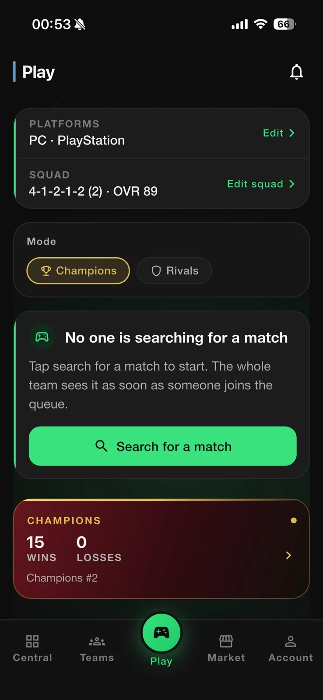
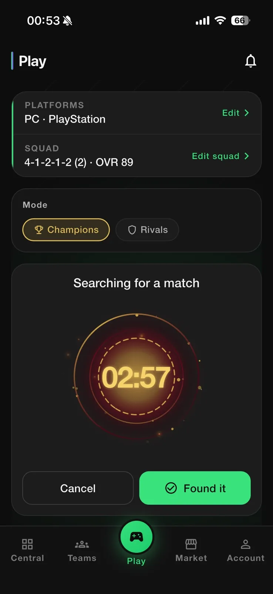
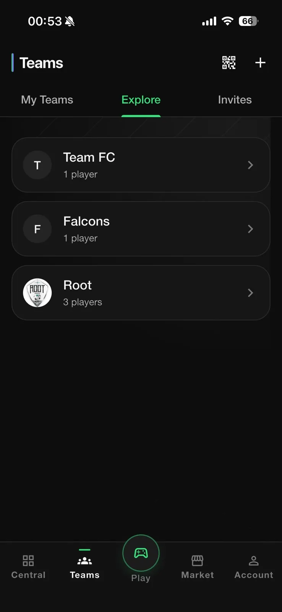
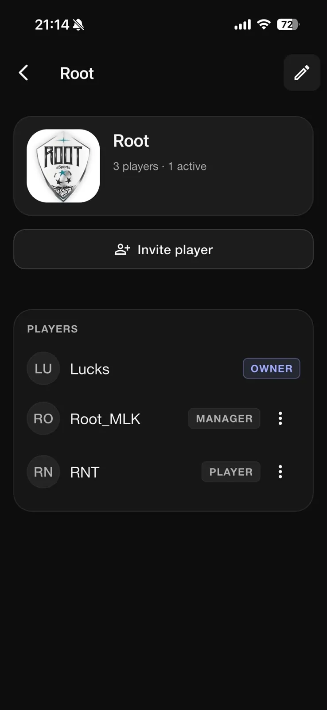
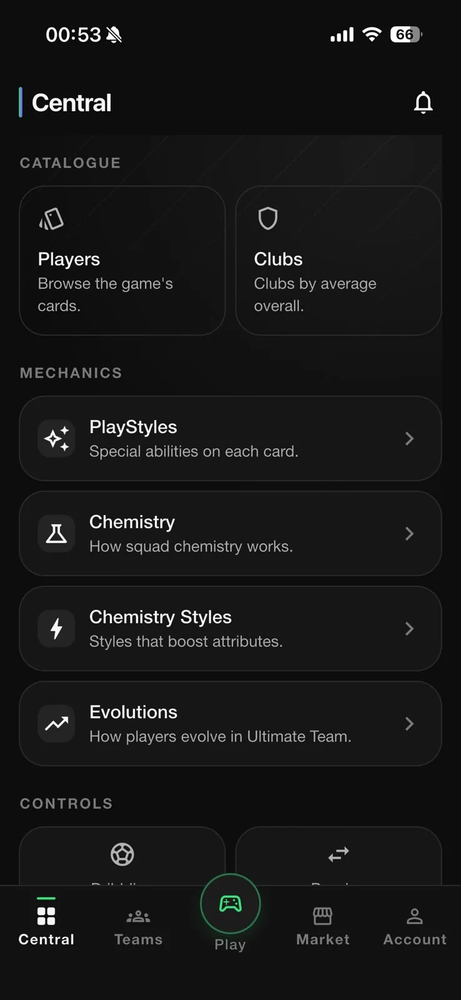
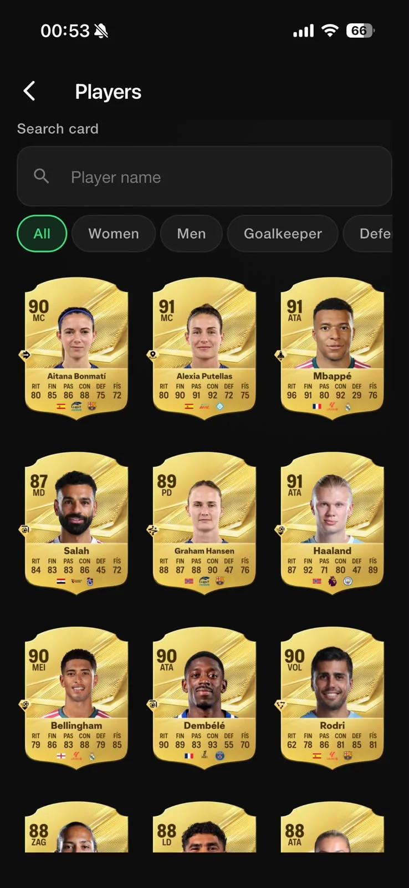
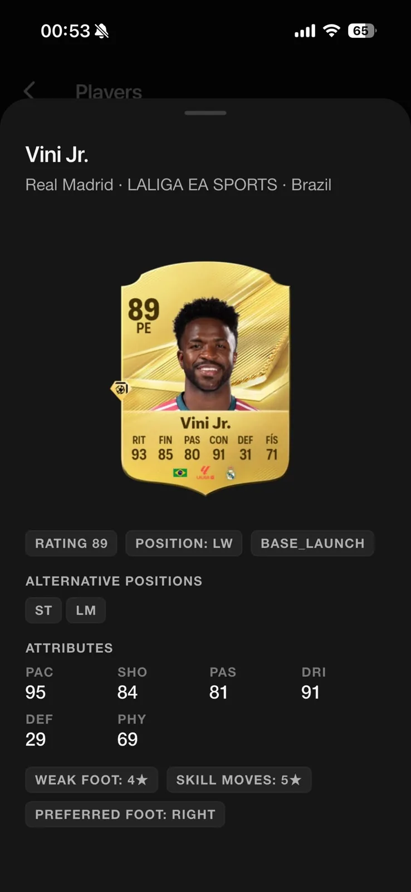
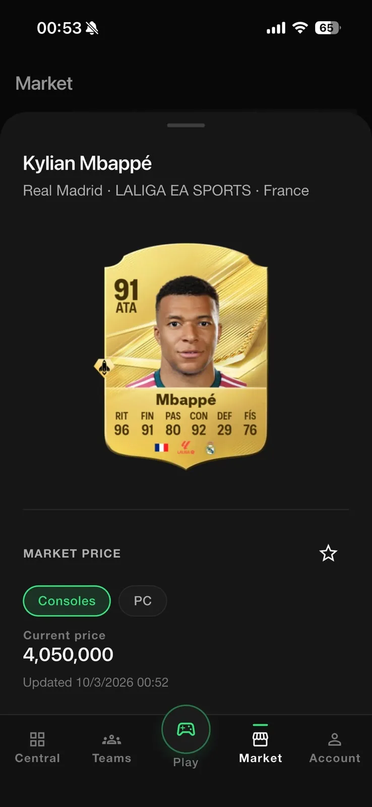
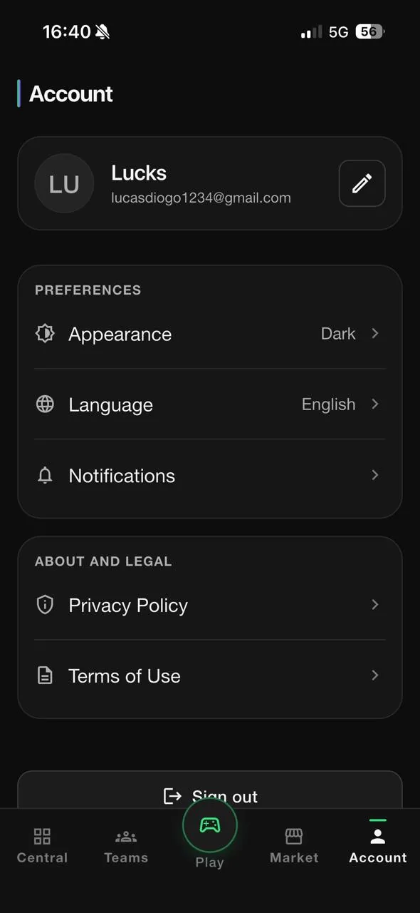

<p align="center">
  
</p>

<h1 align="center">Match Queue</h1>

<p align="center">
  Real-time matchmaking queue and team tools for competitive EA SPORTS FC players.
</p>

<p align="center">
  
  
  
  
  
</p>

<p align="center">
  <b>English</b> · <a href="README.pt-BR.md">Português</a> · <a href="README.es.md">Español</a>
</p>

---

Match Queue helps a team of players who share a game mode (Champions or Rivals) avoid searching at the same time and ending up matched against each other. Only one member of a team searches at a time; the others wait in an ordered queue and take over automatically when it is their turn. Around that queue, the app adds team management, a card catalog, a squad builder, game guides and market prices.

## Availability

<a href="https://apps.apple.com/br/app/match-queue/id6810790338"></a>

- **iOS**: published on the App Store.
- **Android** and **Web (PWA)**: built from the same codebase.
- **Languages**: English, Portuguese (Brazil) and Spanish.

## Screenshots

### From queue to match

<table>
<tr><td align="center" valign="top"><br><sub><b>Play</b></sub></td><td align="center" valign="top"><br><sub><b>Searching for a match</b></sub></td><td align="center" valign="top"><br><sub><b>Teams</b></sub></td></tr>
<tr><td align="center" valign="top"><br><sub><b>Team</b></sub></td></tr>
</table>

### Central and Market

<table>
<tr><td align="center" valign="top"><br><sub><b>Central</b></sub></td><td align="center" valign="top"><br><sub><b>Players</b></sub></td><td align="center" valign="top"><br><sub><b>Card detail</b></sub></td></tr>
<tr><td align="center" valign="top"><br><sub><b>Market</b></sub></td><td align="center" valign="top"><br><sub><b>Account</b></sub></td></tr>
</table>

## Features

**Matchmaking**
- Real-time search queue per team and game mode (Champions or Rivals), with platform and squad picked before searching.
- One active search at a time: while one member is `SEARCHING`, the others are `QUEUED` in order.
- Automatic promotion: when the current searcher finds a match, cancels or times out, the next member in line starts searching.
- Server-side timer with automatic expiration of stale searches, and a cooldown after each search.
- "Match found" flow that moves the team into the match and records the result.
- Search and match history per team and per account.

**Teams**
- Create, explore and join teams; public team pages.
- Member roles (owner, manager and player), including ownership transfer.
- Invitations by code and shareable invite links (`/join/:inviteCode`) that survive the sign-in flow, plus join requests.
- Team dashboard with ranking, top scorers, assists, Champions and Rivals results, and recent activity.

**Central: catalog and guides**
- Player and card catalog with search by name and category filters, covering men's and women's football.
- Card detail: attributes, alternative positions, weak foot and skill moves.
- Clubs, managers, PlayStyles, chemistry styles, Evolutions and consumables.
- Controls guides for dribbling (Skill Moves by star rating), passing, shooting and defending.

**Squad Builder**
- One squad per account, with formations, a pitch view and a position-aware player picker.
- Overall and chemistry calculated by the same rules on the server and in the draft preview.
- Atomic save, so a squad is never stored half-validated.

**Market**
- Current card price per platform, with the date of the last update, and a favorites list.

**Account**
- Email sign-in, profile, shareable public profile, appearance (light/dark), language and notification preferences.
- Push notifications and an in-app notification center with an unread badge.
- Self-service account deletion.

## Architecture

Matchmaking has to stay consistent while many clients act at the same time, so **the server is the only authority**. The app asks and observes; it never decides who is searching.

- **RPC-only access to queue state.** The search session and queue tables have Row Level Security enabled and no client policies. Every change goes through `security definer` RPCs (`request_match_search`, `cancel_match_search`, `report_match_found`, …) that validate membership and state.
- **Locking.** Transaction-scoped Postgres advisory locks serialize matchmaking per team and per user, so a user cannot search for two teams at once and concurrent requests cannot create two active searches.
- **Session expiration.** Expired searches are closed lazily by any RPC that touches the team and periodically by a `pg_cron` job, which also promotes the next member in the queue.
- **Idempotency.** Repeated calls (retries, double taps, rebuilt screens) return the current state instead of creating duplicates. Squad creation and other writes follow the same rule.
- **Realtime as a signal, not as state.** Clients subscribe through Supabase Realtime to a per-team revision counter that only members can read. An event only means "something changed"; the client then re-reads the official state from `get_team_matchmaking_state`. Duplicate, late or out-of-order events are harmless, and a periodic refresh works as a polling fallback.
- **Transactional outbox for notifications.** Notification events are written to an outbox inside the same transaction as the state change. An Edge Function delivers them to Firebase Cloud Messaging, triggered right away by `pg_net` and backed by a one-minute cron. If delivery is down, matchmaking stays correct and pushes are only delayed.
- **Edge Functions** for account deletion, notification delivery and market prices. The price provider sits behind a function, so it can be replaced or disabled without a new app build.
- **Deep links.** Invite and public profile links use App Links / Universal Links on mobile and path-based URLs on the web.

The Flutter app follows a feature-first Clean Architecture (domain, data, presentation), with Cubits for state, `get_it` for dependency injection and `go_router` with authentication guards.

## Tech stack

| Layer | Technology |
| --- | --- |
| App | Flutter, Dart |
| State | `flutter_bloc` (Cubit) |
| DI / Routing | `get_it`, `go_router` |
| Backend | Supabase: Auth, PostgreSQL, RLS, RPCs, Realtime, Storage, Edge Functions (Deno), `pg_cron` |
| Push | Firebase Cloud Messaging |
| Localization | `flutter_localizations` + ARB (`gen-l10n`) |
| Web hosting | Firebase Hosting |
| CI | Codemagic |
| Tests | `flutter_test`, pgTAP |

## Project structure

```
lib/
├── app/            composition root: bootstrap, DI, router, shell
├── core/           config, design system, errors, l10n, logging, navigation, Supabase
├── features/       auth, matchmaking, teams, invitations, requests, history,
│                   central, mechanics, fc_squads, market, notifications,
│                   public_profile, account, settings, legal, onboarding
├── games/          per-game configuration (build flavors)
├── shared/         reusable widgets
└── l10n/           app_en.arb, app_pt.arb, app_es.arb

supabase/
├── migrations/     versioned schema, RLS policies and RPCs
├── functions/      Edge Functions
└── tests/          pgTAP and SQL fixtures
```

## Running locally

Requirements: Flutter (stable channel) and, for a real backend, a Supabase project.

```bash
flutter pub get
cp env/development.example.json env/development.json
flutter run --flavor eaFc --dart-define-from-file=env/development.json --dart-define=APP_GAME=ea_fc
```

On the web, `--flavor` is not used:

```bash
flutter run -d chrome --dart-define-from-file=env/development.json
```

Without Supabase credentials, the app still opens in development mode with local in-memory repositories. To connect a real project, see [`docs/supabase_setup.md`](docs/supabase_setup.md).

```bash
flutter analyze
flutter test
```

## Project status

Published on the App Store and in active development. The codebase also contains early groundwork for supporting a second game through build flavors.

## License

No open-source license is granted. The source code is visible as part of a portfolio; all rights are reserved.

Match Queue is an independent product with no affiliation with EA. EA SPORTS FC and the names and images of players and clubs belong to their respective owners.

## About

Built by Lucas Diogo França. Case study: [lucksrei.com/projects/match-queue](https://lucksrei.com/projects/match-queue/)
