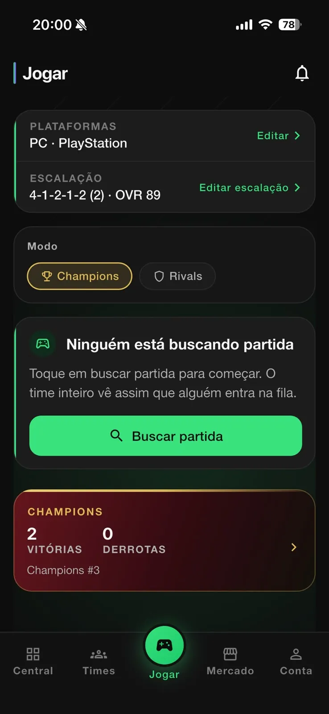
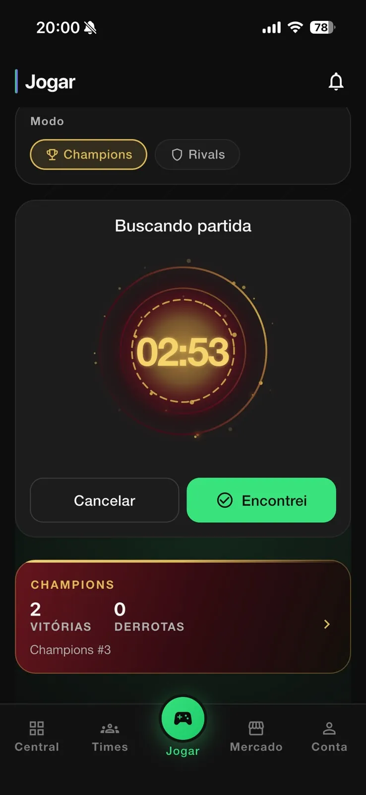
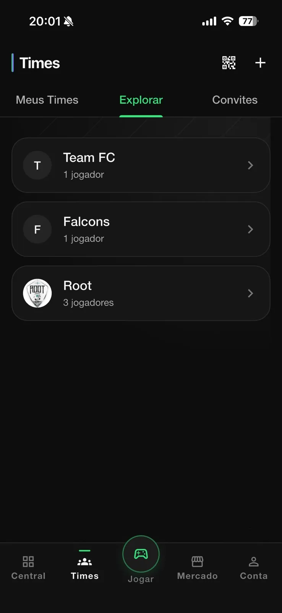
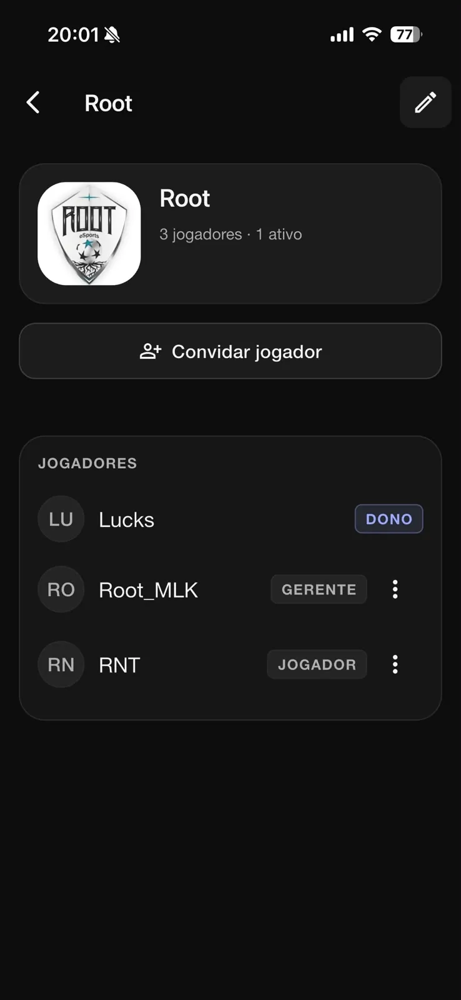
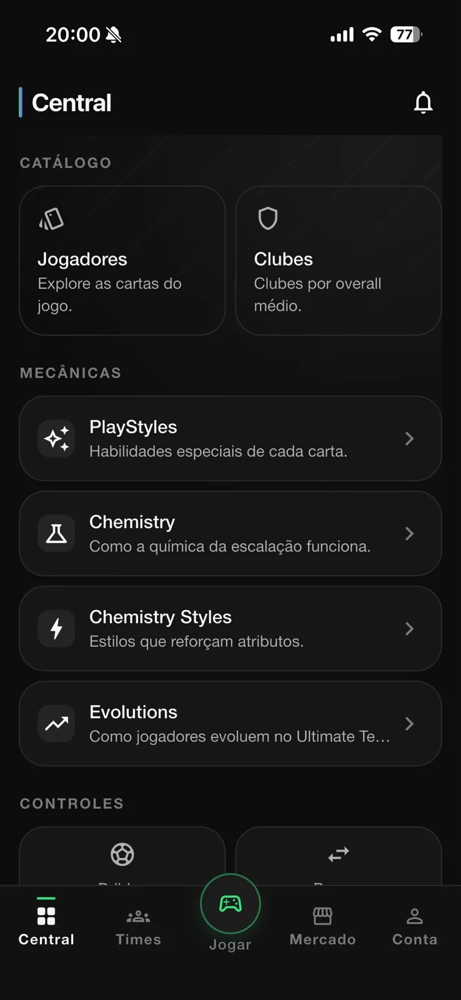
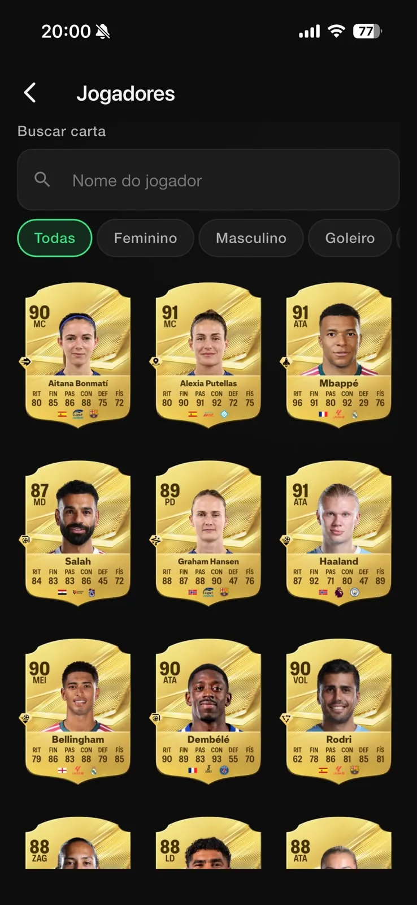
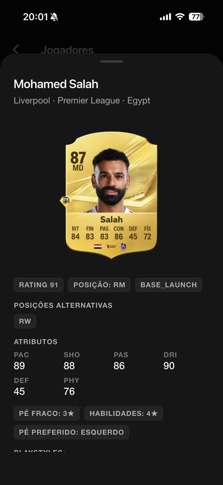
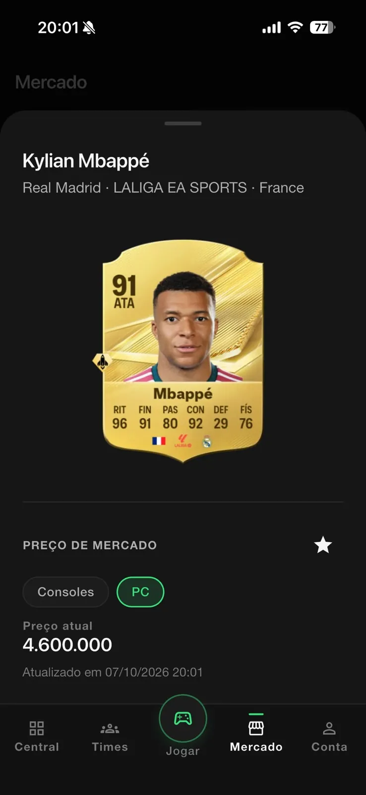
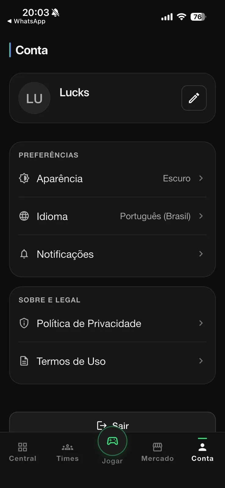

<p align="center">
  
</p>

<h1 align="center">Match Queue</h1>

<p align="center">
  Fila de matchmaking em tempo real e ferramentas de time para jogadores competitivos de EA SPORTS FC.
</p>

<p align="center">
  
  
  
  
  
</p>

<p align="center">
  <a href="README.md">English</a> · <b>Português</b> · <a href="README.es.md">Español</a>
</p>

---

O Match Queue ajuda um time de jogadores que dividem o mesmo modo de jogo (Champions ou Rivals) a não buscar partida ao mesmo tempo e acabar caindo um contra o outro. Só um membro do time busca por vez; os outros esperam numa fila ordenada e assumem a busca automaticamente quando chega a vez deles. Em volta dessa fila, o app reúne gestão de time, catálogo de cartas, montador de elenco, guias do jogo e preços de mercado.

## Disponibilidade

<a href="https://apps.apple.com/br/app/match-queue/id6810790338"></a>

- **iOS**: publicado na App Store.
- **Android** e **Web (PWA)**: gerados a partir da mesma base de código.
- **Idiomas**: inglês, português (Brasil) e espanhol.

## Telas

### Da fila à partida

<table>
<tr><td align="center" valign="top"><br><sub><b>Jogar</b></sub></td><td align="center" valign="top"><br><sub><b>Buscando partida</b></sub></td><td align="center" valign="top"><br><sub><b>Times</b></sub></td></tr>
<tr><td align="center" valign="top"><br><sub><b>Time</b></sub></td></tr>
</table>

### Central e Mercado

<table>
<tr><td align="center" valign="top"><br><sub><b>Central</b></sub></td><td align="center" valign="top"><br><sub><b>Jogadores</b></sub></td><td align="center" valign="top"><br><sub><b>Detalhe da carta</b></sub></td></tr>
<tr><td align="center" valign="top"><br><sub><b>Mercado</b></sub></td><td align="center" valign="top"><br><sub><b>Conta</b></sub></td></tr>
</table>

## Funcionalidades

**Matchmaking**
- Fila de busca em tempo real por time e modo de jogo (Champions ou Rivals), com plataforma e elenco escolhidos antes de buscar.
- Uma busca ativa por vez: enquanto um membro está em `SEARCHING`, os outros ficam em `QUEUED`, em ordem.
- Promoção automática: quando quem está buscando encontra partida, cancela ou tem o tempo expirado, o próximo da fila começa a buscar.
- Timer no servidor, com expiração automática de buscas vencidas e cooldown após cada busca.
- Fluxo de "partida encontrada", que leva o time para a partida e registra o resultado.
- Histórico de buscas e partidas por time e por conta.

**Times**
- Criar, explorar e entrar em times; página pública do time.
- Papéis dos membros (dono, gestor e jogador), com transferência de posse.
- Convites por código e links de convite compartilháveis (`/join/:inviteCode`) que sobrevivem ao login, além de pedidos para entrar.
- Painel do time com ranking, artilharia, assistências, resultados de Champions e Rivals e atividade recente.

**Central: catálogo e guias**
- Catálogo de jogadores e cartas com busca por nome e filtros por categoria, cobrindo futebol masculino e feminino.
- Detalhe da carta: atributos, posições alternativas, perna ruim e dribles (skill moves).
- Clubes, técnicos, PlayStyles, estilos de química, Evolutions e consumíveis.
- Guias de controles para drible (Skill Moves por número de estrelas), passe, finalização e defesa.

**Montador de elenco**
- Um elenco por conta, com formações, visualização em campo e seleção de jogadores que respeita a posição.
- Overall e química calculados pelas mesmas regras no servidor e na prévia do rascunho.
- Salvamento atômico: o elenco nunca fica gravado pela metade.

**Mercado**
- Preço atual da carta por plataforma, com a data da última atualização, e lista de favoritos.

**Conta**
- Login por e-mail, perfil, perfil público compartilhável, aparência (claro/escuro), idioma e preferências de notificação.
- Notificações push e central de notificações no app, com contador de não lidas.
- Exclusão de conta pelo próprio usuário.

## Arquitetura

O matchmaking precisa continuar consistente com muitos clientes agindo ao mesmo tempo, então **o servidor é a única autoridade**. O app pede e acompanha; nunca decide quem está buscando.

- **Estado da fila só por RPC.** As tabelas de sessão de busca e de fila têm Row Level Security ativa e nenhuma policy para o cliente. Toda mudança passa por RPCs `security definer` (`request_match_search`, `cancel_match_search`, `report_match_found`, …) que validam a participação no time e o estado atual.
- **Locks.** Advisory locks do Postgres, no escopo da transação, serializam o matchmaking por time e por usuário: um usuário não busca por dois times ao mesmo tempo e requisições concorrentes não criam duas buscas ativas.
- **Expiração de sessão.** Buscas vencidas são encerradas de forma preguiçosa por qualquer RPC que toque o time e, periodicamente, por um job `pg_cron`, que também promove o próximo da fila.
- **Idempotência.** Chamadas repetidas (retentativas, toque duplo, tela reconstruída) devolvem o estado atual em vez de criar duplicatas. A criação de elenco e outras escritas seguem a mesma regra.
- **Realtime como sinal, não como estado.** O cliente assina, via Supabase Realtime, um contador de revisão por time que só os membros conseguem ler. O evento só significa "algo mudou"; o cliente então relê o estado oficial em `get_team_matchmaking_state`. Evento duplicado, atrasado ou fora de ordem não causa problema, e um refresh periódico funciona como fallback de polling.
- **Outbox transacional para notificações.** Os eventos de notificação são gravados numa outbox na mesma transação da mudança de estado. Uma Edge Function entrega para o Firebase Cloud Messaging, disparada na hora pelo `pg_net` e coberta por um cron de um minuto. Se a entrega cair, o matchmaking continua correto e os pushes só atrasam.
- **Edge Functions** para exclusão de conta, entrega de notificações e preços de mercado. O provedor de preços fica atrás de uma function, então dá para trocá-lo ou desligá-lo sem nova versão do app.
- **Deep links.** Links de convite e de perfil público usam App Links / Universal Links no celular e URLs por caminho na web.

O app Flutter segue Clean Architecture organizada por feature (domain, data, presentation), com Cubits para estado, `get_it` para injeção de dependência e `go_router` com guardas de autenticação.

## Tecnologias

| Camada | Tecnologia |
| --- | --- |
| App | Flutter, Dart |
| Estado | `flutter_bloc` (Cubit) |
| DI / Navegação | `get_it`, `go_router` |
| Backend | Supabase: Auth, PostgreSQL, RLS, RPCs, Realtime, Storage, Edge Functions (Deno), `pg_cron` |
| Push | Firebase Cloud Messaging |
| Localização | `flutter_localizations` + ARB (`gen-l10n`) |
| Hospedagem web | Firebase Hosting |
| CI | Codemagic |
| Testes | `flutter_test`, pgTAP |

## Estrutura do projeto

```
lib/
├── app/            composition root: bootstrap, DI, rotas, shell
├── core/           config, design system, erros, l10n, logging, navegação, Supabase
├── features/       auth, matchmaking, teams, invitations, requests, history,
│                   central, mechanics, fc_squads, market, notifications,
│                   public_profile, account, settings, legal, onboarding
├── games/          configuração por jogo (build flavors)
├── shared/         widgets reutilizáveis
└── l10n/           app_en.arb, app_pt.arb, app_es.arb

supabase/
├── migrations/     schema versionado, policies de RLS e RPCs
├── functions/      Edge Functions
└── tests/          pgTAP e fixtures SQL
```

## Rodando localmente

Requisitos: Flutter (canal stable) e, para usar um backend real, um projeto Supabase.

```bash
flutter pub get
cp env/development.example.json env/development.json
flutter run --flavor eaFc --dart-define-from-file=env/development.json --dart-define=APP_GAME=ea_fc
```

Na web, `--flavor` não é usado:

```bash
flutter run -d chrome --dart-define-from-file=env/development.json
```

Sem credenciais do Supabase, o app abre normalmente em modo de desenvolvimento, com repositórios locais em memória. Para conectar um projeto real, veja [`docs/supabase_setup.md`](docs/supabase_setup.md).

```bash
flutter analyze
flutter test
```

## Status do projeto

Publicado na App Store e em desenvolvimento ativo. A base de código também já tem a estrutura inicial para suportar um segundo jogo via build flavors.

## Licença

Nenhuma licença open source é concedida. O código está visível como parte de um portfólio; todos os direitos reservados.

O Match Queue é um produto independente, sem vínculo com a EA. EA SPORTS FC e os nomes e imagens de jogadores e clubes pertencem aos seus respectivos donos.

## Sobre

Desenvolvido por Lucas Diogo França. Case: [lucksrei.com/projects/match-queue](https://lucksrei.com/projects/match-queue/)
